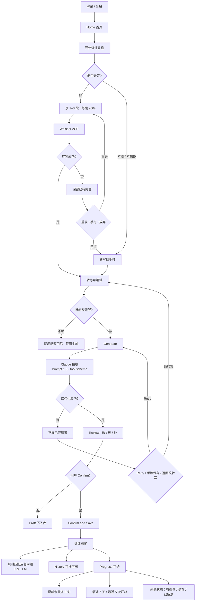
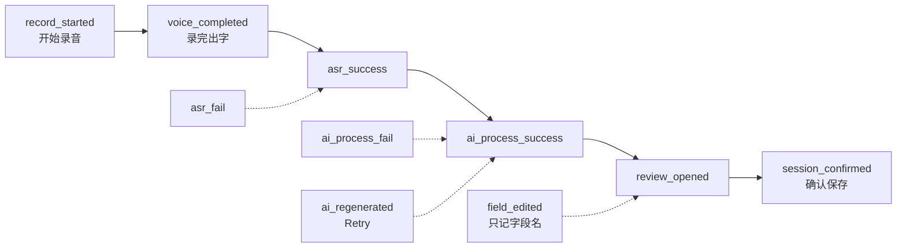
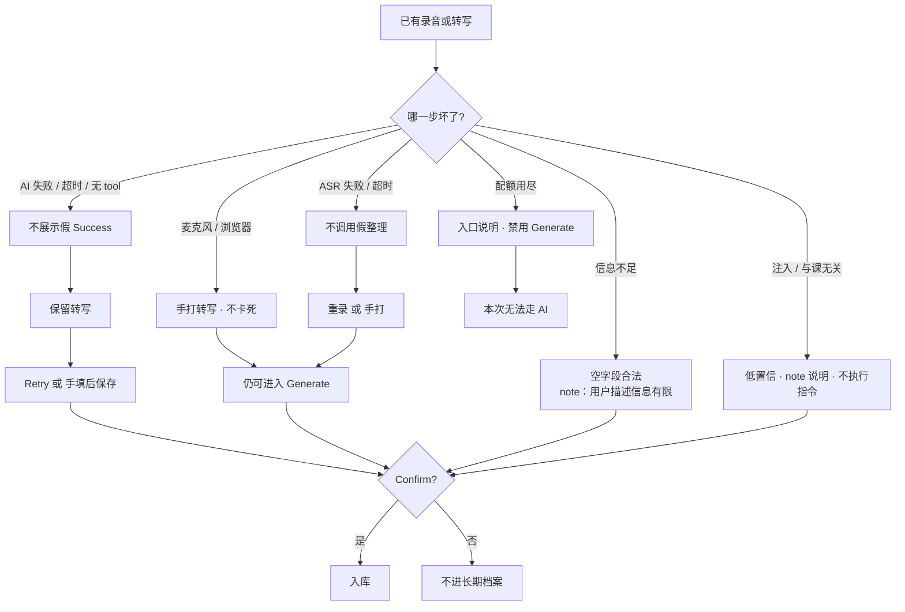
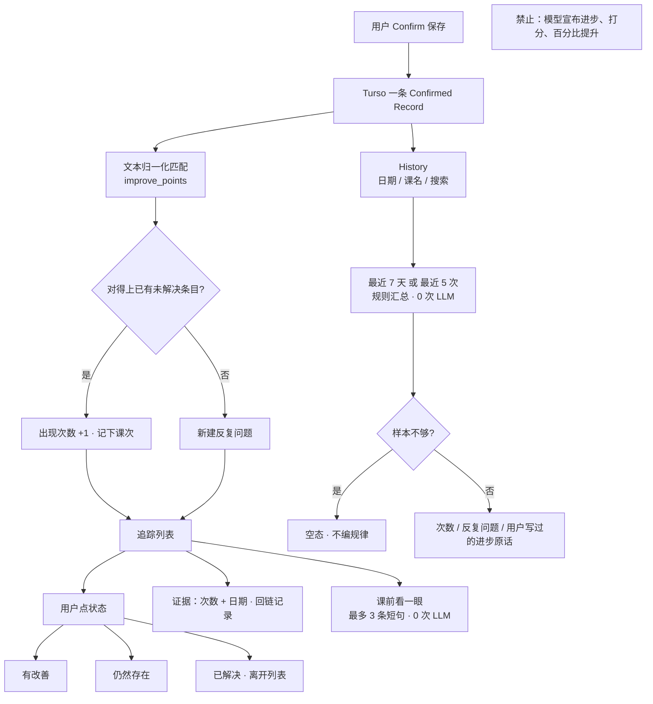

# 2.0 用户流程图｜BalletMind

> 对应 PRD 2.0 · 2026-09-08  
> 可贴进 Notion：`/code` → 语言选 Mermaid。  
> **图片版**  
> - 横版一张（方便贴 Notion / 面试）：[`2.0_user_flow.png`](2.0_user_flow.png)  
> - 竖版总览（分支更全）：[`2.0_user_flow_overview.png`](2.0_user_flow_overview.png)  
> 原则：**主路径一次课走完保存**；ASR/AI 挂了不编造成功；Progress 是保存之后的可选支路，跨课次 **0 次 LLM**。

---

## 图 1 · 总览（面试/文档首页用这张）

---

## 图 2 · Capture 漏斗（和 Layer 3 session 对齐）

同一 `sessionId` 才算一次语音转化。手打进档案 **不算进这条语音漏斗**。

侧指标（不是漏斗台阶）：History / Progress 用 browse session，不挂在这一次课上。

---

## 图 3 · 异常与降级（宁可少生成，也不编造）

---

## 图 4 · 保存之后：档案 + Progress（规则，不打断主路径）

---

## 怎么读这四张图

| 图 | 回答什么 |
| --- | --- |
| 1 | 用户从登录到存档、以及 Progress 在哪分叉 |
| 2 | 埋点漏斗，避免 unique 用户相除 |
| 3 | ASR/AI 挂了产品怎么活 |
| 4 | 为什么跨课次不用 Claude |

1.0 文档里的「Generate 后 AI 写周复盘」**不要画进 2.0**。周/次汇总只走图 4 的规则框。
