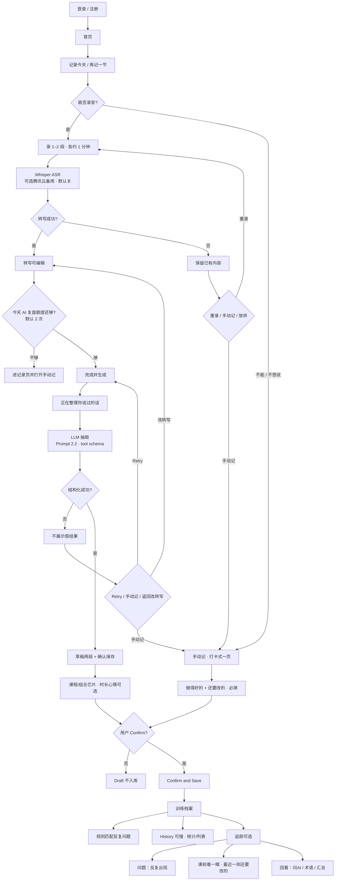
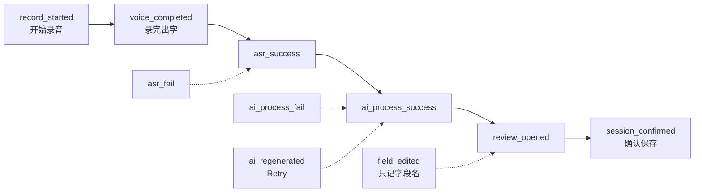
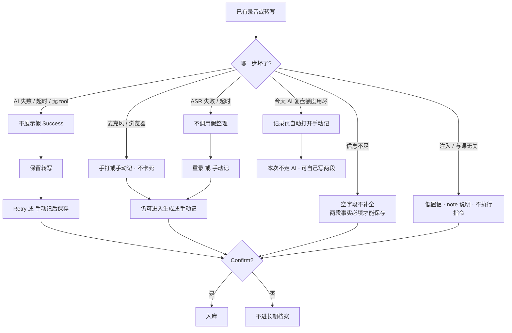
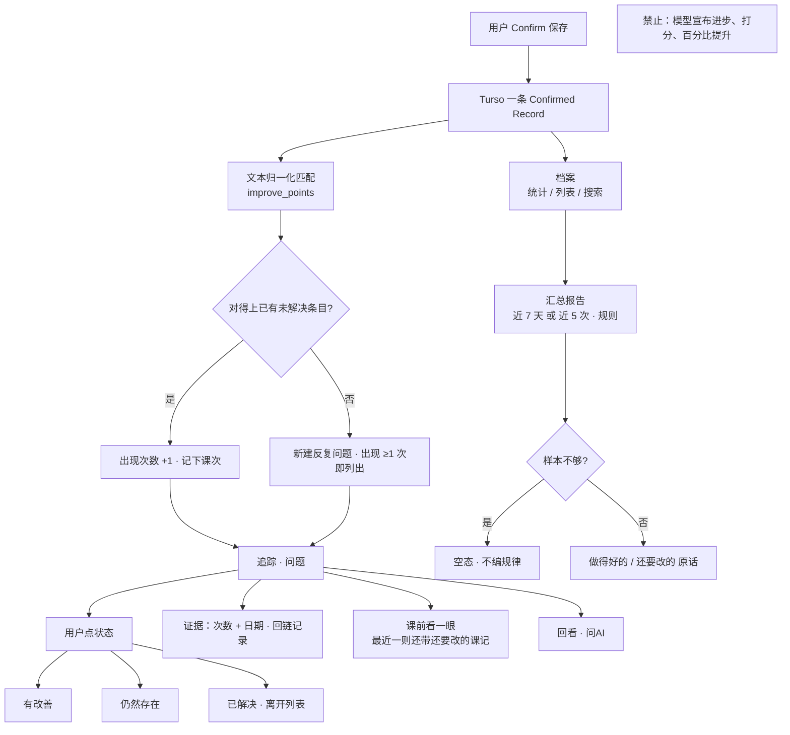
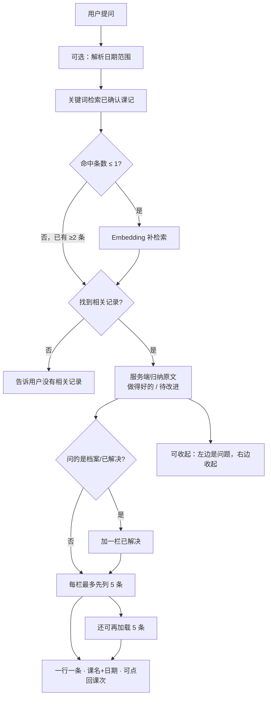
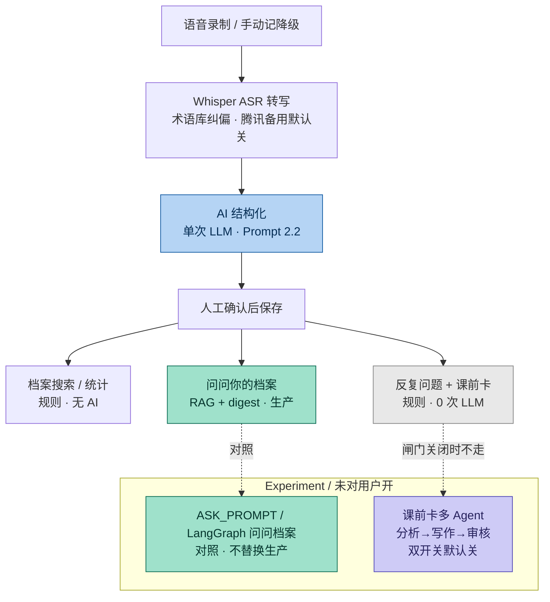

# 2.0 用户流程图｜BalletMind

> 对应 PRD 2.0 · **2026-10-03**  
> 可贴进 Notion：`/code` → 语言选 Mermaid。  
> **图片版**  
> - 横版总览：[`2.0_user_flow.png`](2.0_user_flow.png)  
> - 竖版总览：[`2.0_user_flow_overview.png`](2.0_user_flow_overview.png)  
> - 漏斗：[`2.0_user_flow_funnel.png`](2.0_user_flow_funnel.png)  
> - 降级：[`2.0_user_flow_degrade.png`](2.0_user_flow_degrade.png)  
> - 档案 / Progress：[`2.0_user_flow_progress.png`](2.0_user_flow_progress.png)  
> - 问问档案：[`2.0_user_flow_ask.png`](2.0_user_flow_ask.png)  
> - 技术架构（RAG / 抽取 / 多Agent 分布）：[`2.0_architecture_agents.png`](2.0_architecture_agents.png)  
> 原则：**主路径一次课走完保存**；确认页两段事实（做得好的 / 还要改的）；ASR/AI 挂了不编造成功。Progress 是保存之后的可选支路。课前卡和反复问题默认用规则。问问档案：检索后直接列出课记原文（做得好的 / 待改进 / 问档案时才有已解决），**不**再让大模型写一段新回答。多 Agent 课前卡是 Experiment，已接线、双开关默认关。账号支路：「我的」可导出全部数据或注销删账号（需密码，不画进主漏斗）。**只打卡**是首页旁路：不录音、不占 AI 复盘额度、不算语音漏斗完成。额度用尽走手动记，不卡死。

---

## 图 1 · 总览（面试/文档首页用这张）

---

## 图 2 · Capture 漏斗（和 Layer 3 session 对齐）

同一 `sessionId` 才算一次语音转化。手打 / 手动记进档案 **不算进这条语音漏斗**。

侧指标（不是漏斗台阶）：History / Progress / 问问档案用 browse session，不挂在这一次课上。

---

## 图 3 · 异常与降级（宁可少生成，也不编造）

---

## 图 4 · 保存之后：档案 + Progress

---

## 图 5 · 问问你的档案（检索 + 原文归纳，不二次写作）

生产 `/api/progress/ask` **不调用** Claude / DeepSeek 写回答。仓库里仍有 `ASK_PROMPT` 2.3 与对照脚本，只作实验，不是现网路径。

---

## 图 6 · 技术架构总览（含 experiments）

生产课前卡和反复问题走规则（0 次 LLM）。问问档案是线上 RAG 检索 + 服务端 digest，不再走单 Agent 写作。抽取是单次 LLM（默认 Anthropic；可配 DeepSeek 等 openai-compatible，超时约 5s 可切备用）。多 Agent 课前提醒已接到 `GET /api/progress/brief`，双开关默认全关。LangGraph 问问档案只在 `experiments/`。

---

## 怎么读这些图

| 图 | 回答什么 |
| --- | --- |
| 1 | 用户从登录到存档、以及 Progress 在哪分叉 |
| 2 | 埋点漏斗，避免 unique 用户相除 |
| 3 | ASR/AI 挂了、额度用尽时产品怎么活 |
| 4 | 保存之后：规则追踪 + 问档案入口 |
| 5 | RAG 先关键词，命中不够才 Embedding；列出课记原文，不二次写作 |
| 6 | 全链路哪里是规则、哪里是单次LLM、哪里是检索、哪里是多Agent |

1.0 文档里的「Generate 后 AI 写周复盘」**不要画进 2.0**。周/次汇总只走图 4 的规则框。
